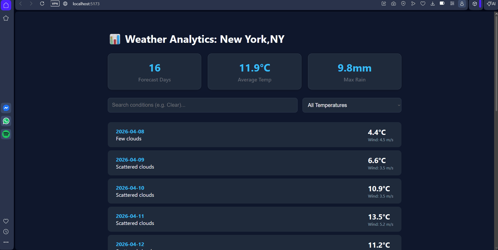

Submitted by: Duban Correa

WeatherWise is a data dashboard application that provides an at-a-glance summary of weather forecasts for New York City. By leveraging the WeatherBit API, users can explore a 16-day forecast, search for specific conditions, and filter results by temperature ranges to uncover trends in local climate data.

Time spent: 6 hours spent in total

Required Features
The following required functionality is completed:

[x] API Fetching: The site has a dashboard displaying a list of data fetched using an API call with useEffect and async/await syntax.

[x] Unique Items: The dashboard displays at least 10 unique items (16-day forecast), one per row.

[x] Row Attributes: The dashboard includes at least two features in each row (Date, Condition Description, Temperature, and Wind Speed).

[x] Summary Statistics: The dashboard includes at least three summary statistics about the data (Total Days Shown, Average Temperature, and Maximum Precipitation).

[x] Search Functionality: A search bar allows the user to search for a specific weather condition (e.g., "Clouds", "Rain") in the fetched data.

[x] Dynamic Search: The search bar correctly filters items in the list, and the results update dynamically as the user types.

[x] Category Filtering: An additional filter (dropdown) allows the user to restrict displayed items by temperature categories (Warm vs. Cool).

[x] Attribute Restriction: The filter restricts items in the list using a different attribute (Temperature) than the search bar (Description).

[x] Dynamic Filtering: The dashboard list dynamically updates as the user adjusts the filter selection.

The following stretch features are implemented:

[x] Simultaneous Filtering: Multiple filters (Search and Temperature) can be applied at the same time to narrow down specific data points.

[x] Different Input Types: The UI uses both a text input for searching and a dropdown menu for category selection.

Video Walkthrough
Here's a walkthrough of implemented required features:

GIF created with ScreenToGif

Notes
The most significant challenge in this project was handling the 403 Forbidden error from the WeatherBit Business Trial API. I had to troubleshoot whether the issue was due to API key activation delays or endpoint restrictions. To ensure the dashboard remained functional for the user, I implemented robust error handling that alerts the user if the API key is pending verification while maintaining the integrity of the filtering and statistics logic. Additionally, ensuring that the .filter() and .map() methods worked in tandem to update the summary statistics in real-time required careful state management.

License
Copyright 2026 Duban Correa

Licensed under the Apache License, Version 2.0 (the "License");
you may not use this file except in compliance with the License.
You may obtain a copy of the License at

http://www.apache.org/licenses/LICENSE-2.0

Unless required by applicable law or agreed to in writing, software
distributed under the License is distributed on an "AS IS" BASIS,
WITHOUT WARRANTIES OR CONDITIONS OF ANY KIND, either express or implied.
See the License for the specific language governing permissions and
limitations under the License.